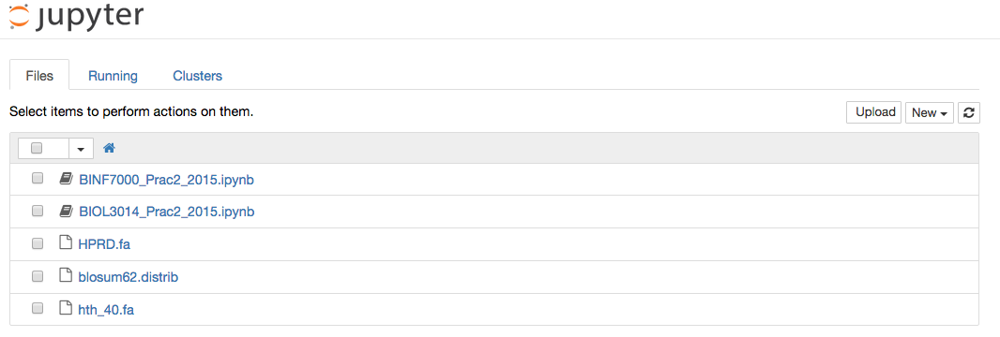

BIOL3014/BINF7000 Practical 2: Probabilistic motif discovery
============================================================

* Due: 11 AM Wednesday 12/08/2015
* Revision: 1 
* Marks: BIOL3014 - 8 marks total. BINF7000 - 12 marks total.

Probabilistic motif discovery
-----------------------------

This practical will help you understand concepts related to Motif discovery, 
Gene ontology and statistical testing (BINF7000 only).

You will be writing your own python code, using pre-existing python modules 
provided by the uqbinfpy library and providing written answers.

Instructions
------------

**We expect this practical to be performed on the UQ ILC computers using the 
OSX Yosemite image.**

In Practical 1 you installed the IPython notebook tool. Once you have logged 
into the ILC computer you need to tell Python where to find the previous 
install of the IPython notebook tool. In the *terminal application*, execute 
the following commands::

    export PYTHONPATH=$PYTHONPATH:/Users/local_user/Library/Python/2.7/lib/python/site-packages/
    export PATH=$PATH:/Users/local_user/Library/Python/2.7/bin/

**Note:** you can make the PATH changes persistent between sessions by adding 
to the file `~/.bash_profile` the following lines::

    export PYTHONPATH=$PYTHONPATH:/Users/local_user/Library/Python/2.7/lib/python/site-packages/
    export PATH=$PATH:/Users/local_user/Library/Python/2.7/bin/

Then in the terminal type::
    
    source ~/.bash_profile

This practical once again uses the uqseqlib_ (interchangeably called uqbinfpy) 
Python library, a purpose built set of Python modules for UQ Bioinformatics courses. 
You will need  to **fetch the latest version of uqseqlib**. In the 
*terminal application*, execute the following command::

    pip install --user --upgrade git+https://github.com/UQ-BIOL3014/uqbinfpy.git

Finally, the IPython notebook for Practical 2 and all associated data can be 
downloaded using the following commands::
    
    cd ~/BIOL3014
    git clone https://github.com/UQ-BIOL3014/Practical2
    cd Practical2/notebook
    ipython notebook

You should see this -

Click on the notebook prefixed with the course identifier that you are enrolled in.

Submission Requirements
-----------------------

Please submit your IPython notebook with the completed code blocks and 
written answers where requested via the BIOL3014/BINF7000 Blackboard 
submission system. Use the format *STUDENT_NUMBER_P2.ipynb*. Detailed 
instructions are provided at the start of Practical 2.

Late submissions without sufficient reason will incur a 20% loss of the total 
score per late day.

.. _`IPython Notebook`: http://ipython.org/notebook.html
.. _uqseqlib: https://github.com/UQ-BIOL3014/uqbinfpy
.. _`Python Guide`: https://github.com/UQ-BIOL3014/Practical1/blob/master/notebook/Python_Guide.pdf
